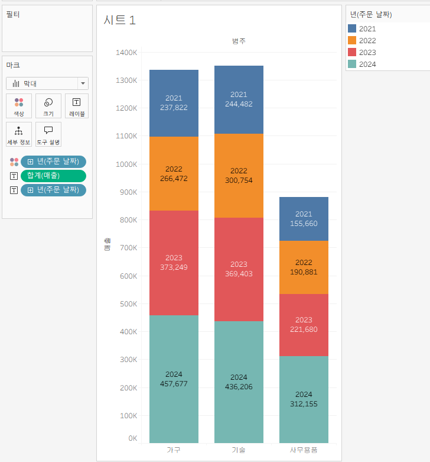
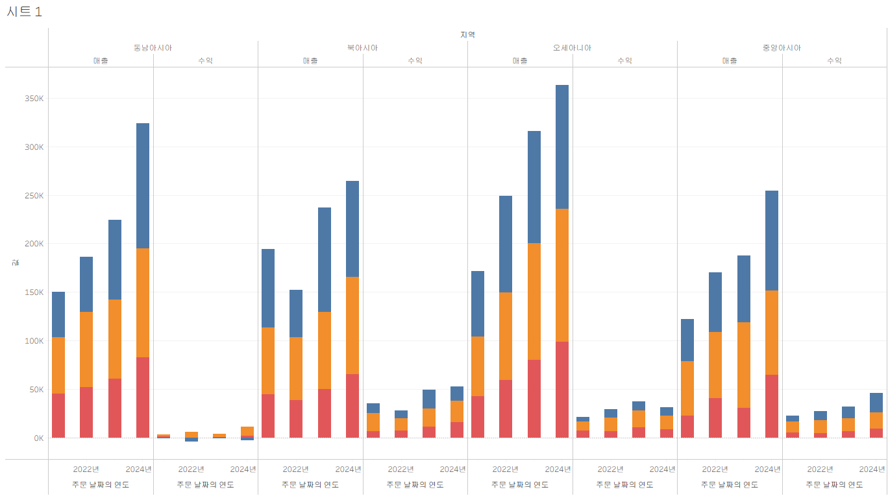
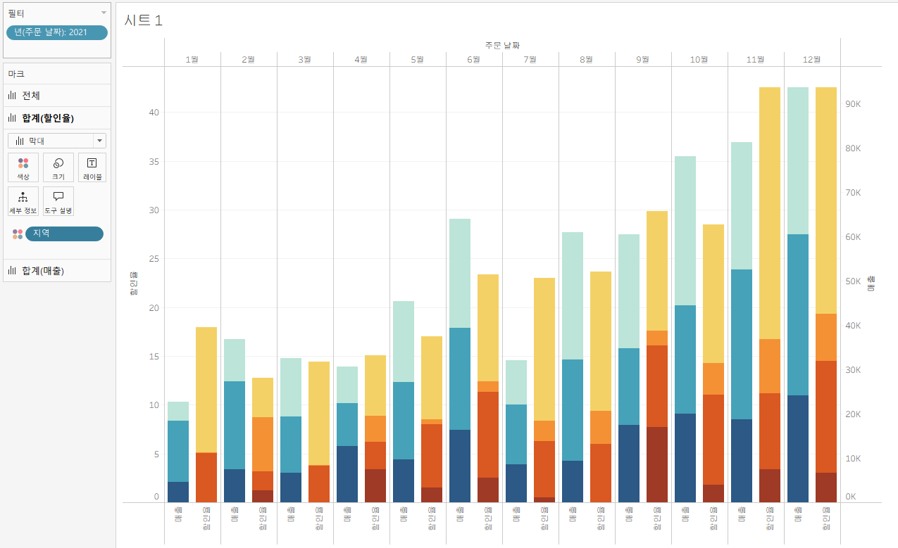
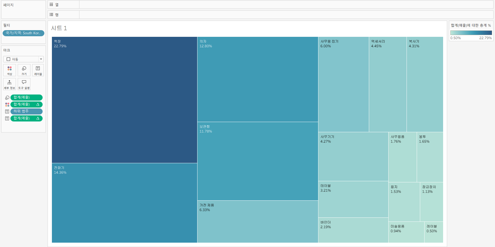
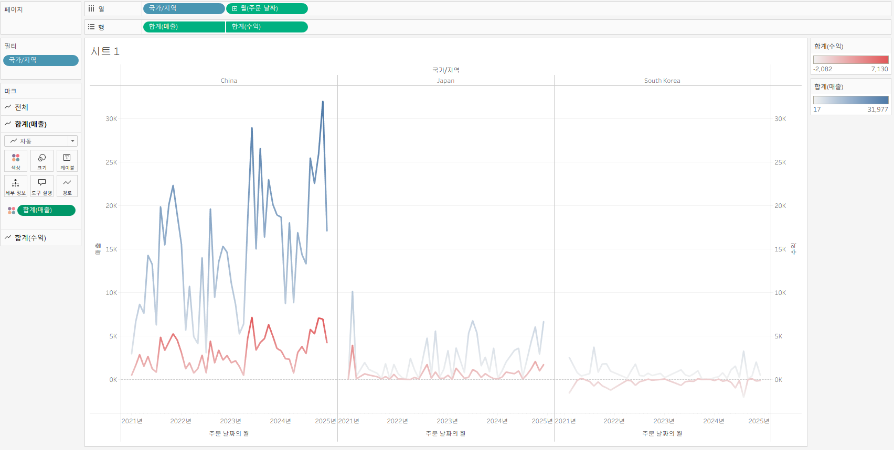

# Tableau 2주차 정규과제

📌Tableau 정규과제는 매주 정해진 **유튜브 강의를 통해 태블로 이론 및 기능을 학습한 후, 실습 문제를 풀어보며 이해도를 높이는 학습 방식**입니다. 

이번주는 아래의 **Tableau_2nd_TIL**에 명시된 유튜브 강의를 먼저 수강해주세요. 학습 중에는 주요 개념을 스스로 정리하고, 이해가 어려운 부분은 강의 자료나 추가 자료를 참고해 보완하세요. 과제 작성이 끝난 이후에는 **Github에 TIL과 실습 인증 결과를 업로드 후, 과제 시트에 제출해주세요.**


**(수행 인증샷은 필수입니다.)** 

> 태블로를 활용하는 과제인 경우, 따로 캡쳐도구를 사용하여 이미지를 첨가해주세요.


## Tableau_2nd_TIL

### 10. 차원과 측정값

### 11. 시각화

### 12. 막대 그래프

### 13. 누적막대 그래프

### 14. 병렬막대 그래프

### 15. 누적병렬막대 그래프

### 16. 라인 그래프

### 17. 맵 작성

### 18. 텍스트 레이블

### 19. 트리맵과 하이라이트 테이블


<br>

## 주차별 학습 (Study Schedule)

| 주차  | 공부 범위          | 완료 여부 |
| ----- | ------------------ | --------- |
| 1주차 | **강의 1 ~ 9강**   | ✅         |
| 2주차 | **강의 10 ~ 19강** | ✅         |
| 3주차 | **강의 20 ~ 29강** | 🍽️         |
| 4주차 | **강의 30 ~ 39강** | 🍽️         |
| 5주차 | **강의 40 ~ 49강** | 🍽️         |
| 6주차 | **강의 50 ~ 59강** | 🍽️         |
| 7주차 | **강의 60 ~ 69강** | 🍽️         |

<!-- 여기까진 그대로 둬 주세요-->


---

# 1️⃣ 학습 내용 정리

## 10강: 차원과 측정값

#### 차원
- 정성적인 값(이름이나 카테고리처럼 집계되거나 개선되지 않는 독립적인 값)을 가지고 있는 필드
- 불연속형 필드 : 하나의 독립적 값을 가짐

#### 측정값
- 정량적인 값(매출이나 수익, 수령 등 집계될 수 있는 값)을 가지고 있는 필드
- 연속형 필드 : 값이 끊어지지 않는 연속적인 범위를 가짐

#### ⚠️주의사항
항상 *차원=불연속형, 측정값=연속형* 은 아님 
➡️ **시각화 하고자 하는 방식에 따라** 달라짐
  - 모든 컬럼은 사용자가 차원, 측정값, 연속형, 불연속형으로 변경 가능


> **🧞‍♀️ 차원과 측정값의 고유한 특성에 대해 설명해주세요.**

```
차원 : 정성적인 값을 가지고 있는 필드
측정값 : 정량적인 값을 가지고 있는 필드
```

*Quiz: 차원은 불연속형이고, 측정값은 연속형이다 (x)*


## 11강: 시각화

#### 1) 뷰에 바로 시각화
- 데이터 패널의 필드를 시트로 추가
- crtl 킬르 누른 채 2개의 필드를 선택해서 추가

#### 2) 행, 열 시트로 시각화
- 데이터 패널의 필드를 열, 행에 드래그하여 시각화

#### 3) 마크 활용하여 시각화
- 데이터 패널의 필드를 원하는 마크로 드래그 드롭


>💡Tableau 가 추천하는 시각화 방법 외에도 우측 상단 **표현방식** 에서 변경하여 시각화 가능

> **머리글**
> - 표나 시각화에서 행/열의 제목
> - **차원**이 들어가면 보통 머리글로 표시
>
> **패널**
> - 머리글로 나뉜 영역 안에 들어가는 값
> - 측정값이 들어가면 보통 셀(패널)에 값이 채워짐

*Quiz: 차원은 대부분 불연속형이며 표 형태로 시각화했을 때 머리글로 표시되고, 측정값은 대부분 연속형이므로 표 형태로 시각화 진행했을 때 패널로 추가된다. (o)*


## 12강: 막대그래프
#### 막대그래프 시각화
- 여러 범주의 데이터를 비교할 때 유용하게 사용 
- 빠른 메뉴 아이콘 > 내림차순 버튼 클릭하면 큰 값 기준으로 정렬 가능
- **가로막대차트** : 게로 막대차트에서 행렬 변경
  - 빠른 메뉴 아이콘 > 행렬 바꾸기
  - 차원 필드를 행으로, 측정값 필드를 열로 드롭

#### 마크 활용하여 시각화
##### 1) 색상 구분
- 필드를 마크의 색상으로 드롭
- 색상 구분 후 내림차순 할 경우, 범례까지 내림차순은 되지 않으므로 범례 색상 정렬도 바꿔주어야함
- 색상 편집에서 색 수정, 모양 할당에서 그라데이션 가능

##### 2) 그래프 위에 텍스트
- 필드를 마크의 레이블로 드랍
- 레이블 편집에서 글자 표시 위치도 변경 가능

##### 3) 그래프 두께 변경
- 필드를 마크의 크기로 드랍

## 13강: 누적막대그래프
- 목적 : 차원별로 측정값의 비중으로 보여주기 위함
- 방법 : 필드를 마크 창의 세부정보로 드롭



- 테이블 아래로 : 같은 행 그룹에서만 비율 계산
- 테이블 옆으로 : 전체 데이터를 기준으로 비율 계산

## 14강: 병렬막대그래프
- 기본 막대그래프를 그룹화해서 나타내는 차트

#### 시각화할 때 데이터 연속/불연속 변환하는 방법
##### 1) 테이블 원본에서 연속형으로 변환
- 단점
  - 표현하려는 뷰마다 데이터를 변경해야함
  - 다른 시트에서 해당 데이터를 사용할 때 데이터 유형의 충돌이 발생할 수 있음

##### 2) [추천] 표시하려는 뷰에서 데이터 유형 변경

##### 3) 열/행 선반에 데이터를 올려놓을 때 필드 유형 선택
- 방법 : 마우스 오른쪽 클릭한 상태로 열/행 선반에 드롭하면 연속형/불연속형 선택 가능


> *🧞‍♀️ 끊어진 색상으로 배치되어 표현되는 경우와 이어지는 그라데이션 색으로 표현되는 경우 두 가지가 있습니다. 위 사진의 경우 왜 색깔이 끊어지는 색상으로 표시되지 않고 그라데이션으로 표시되었나요? 데이터의 특성과 관련하여 이야기해 봅시다.*

```
날짜 데이터를 연속형으로 변환하여 Tableau 가 시간의 흐름을 인식할 수 있게 되었습니다.
```


## 15강: 누적병렬막대그래프






> *🧞‍♀️ 위 사진에서는 Profit과 Sales를 측정값으로 두었습니다.  개별 칼럼(태블로에서는 #필드라 명칭합니다)을 열/행에 두는 대신, '측정값'을 사용하고 측정값 선반에 필드를 올려둡니다. 이런 방식을 사용하는 이유가 무엇일지, 어떻게 사용할 수 있을지 고민해보세요*

```
여러 지표를 표나 그래프에 동시에 동일하게 사용할 수 있기 때문에...? 동일한 지표를 가지고 여러 시각화를 하고 싶을 때 관리하기 편리함...?
```


## 16강: 라인그래프
- 데이터의 시간별 추세를 확인하거나 해당 데이터를 통해 미래값을 예측하려는 경우 많이 사용
- Tableau는 열에 날짜 필드가 있으면 자동으로 라인그래프로 시각화

❓서로 다른 두 측정값을 비교하는 라인그래프 ➡️ 이중축 활용
⚠️다만, 양쪽의 세로축이 다른 범위일 수 있어서 비교를 위해서는 **축 동기화** 必


## 17강: 맵작성
- 경도와 위도 좌표가 있는 위치 데이터를 가지고 있으면 Tableua 의 지리적 역할을 통해 맵을 그릴 수 있음
  - 우리나라는 시/도, 시/군/구만 지원하기 때문에 더 하위 지역을 표현하기 위해서는 해당 구역이 그려진 공간파일을 Tableau 에 따로 연결해야함
- 💡마크 계층 활용 : 다양한 위치를 표시하고 싶을 때, 맵에 여러 계층의 지리적 데이터를 추가하는 경우 활용

```js
## 참고
Country/Region - 나라/지역
State/Province - 시/도
City - 시
County - 군
Postal Code - 우편번호
Area Code - 지역 코드
Airport - 공항
MSA/CBSA (Metropolitan Statistical Area) - 광역 통계 지역
Longitude - 경도
Latitude - 위도
```


## 18강: 텍스트테이블
- 텍스트 테이블은 일반적으로 보는 표 형식
- 시트에서 데이터가 아닌 **분석** 창으로 가면 별도의 계산식 없이도 소계, 총계 등을 계산해줌

❓패널 아래로
- 범주별 소계를 계산하면, 패널 아래로를 클릭해서 각 범주 내에서 구성 비율을 계산해줌


## 19강: 트리맵과 하이라이트테이블
#### 트리맵
- 비교적 간단한 데이터 시각화 방법
- 장점: 직관적으로 데이터 크기를 비교할 수 있음

#### 하이라이트 테이블
- 색상이 입혀진 특수 테이블
- 범주형 데이터를 색상으로 비교할 수 있어 텍스트 테이블에 여러가지의 다양한 데이터를 나타내야할 때 하이라이트 테이블을 이용하면 보다 효과적으로 수치 비교 가능
- tip❗ 범주별로 그라데이션 없이 단일 색상으로 표현하고 싶을 때는 범례를 더블 클릭하고 색상표에서 사용자 지정 단일을 클릭하여 원하는 색상 고르기


> *🧞‍♀️하이라이트 테이블 등에서 두개 이상의 측정값을 사용하는 경우, 함께 색을 표현하게 되면 단위가 달라 정확한 값을 표현할 수 없습니다. 이때 클릭해야 하는 항목은?*

```
범례 더블클릭하여 색상표에서 '사용자 지정 단일'을 클릭
```


<br>

# 2️⃣ 확인문제

## 문제1

```js
지민이는 superstore의 한국 수출 관리 업무를 맡고 있습니다. 국가/지역이 우리나라, 즉 'South Korea'인 데이터만을 필터링하여, 상품 하위범주 별로 각 하위범주가 매출의 비율 중 얼마만큼을 차지하는지를 트리맵으로 확인하고 싶습니다. 트리맵의 각 네모 안에 표시되는 텍스트에는 **해당 범주의 이름과 전체에서 해당 범주가 차지하는 비율**이 표시되었으면 합니다.

지민이를 도와주세요! (풀이를 찾아가는 과정을 기술해주세요)
```


```
국가는 South Korea로 필터를 걸어주고
하위범주를 행으로, 매출을 열로 보내 트리맵으로 표현해주고
매출을 구성비율로 표현해준 다음, ctrl 을 눌러 마크의 레이블로 가져가면 텍스트도 표시됨
맞는지는 모르겠지만 아무튼 지민이가 지민이를 도와줬어요
```


## 문제2

```js
주영이는 국가/지역별로 매출과 수익의 증감을 시간에 흐름에 따라 표현하고자 합니다. 특히 **한국/중국/일본**을 비교하고자 해당 3국을 남기고 필터링했고, 3개 국가를 매출과 수익이라는 두 가지 지표로 확인해보았습니다.

아래는 위 설명을 표현해본 예시입니다.
```


```js
레퍼런스와 꼭 같지 않아도 자유롭게 표현하고, 그 과정을 기술해주세요.
```


```
국가는 South Korea, Japan, China 로 필터를 걸어주고
수익, 매출을 행으로, 필터된 국가와 연속형으로 변환한 주문날짜를 열로 보내 이중축 라인차트로 표현해주고
축 동기화를 해주고 각 매출과 수익의 색만 다르게 설정해주면 오늘의 요리 완성
```


### 참고 자료

```js
테이블 계산에서 '다음을 사용하여 계산'에는 테이블 당 계산과 패널 당 계산이 있습니다. 이에 대해 이해하는 것이 꼭 필요하기 때문에, 외부 레퍼런스를 참고하여 이 단계에서 꼭! 학습 후, 넘어가주세요 :)
```


[참고 외부자료 링크는여기를클릭하십시다](https://velog.io/@eunsuh/Tableau-%EB%A0%88%EB%B2%A8UP-%EA%B0%95%EC%9D%98-%EC%A0%95%EB%A6%AC-1-%ED%85%8C%EC%9D%B4%EB%B8%94-%EA%B3%84%EC%82%B0)

<br>

<br>

### 🎉 수고하셨습니다.t