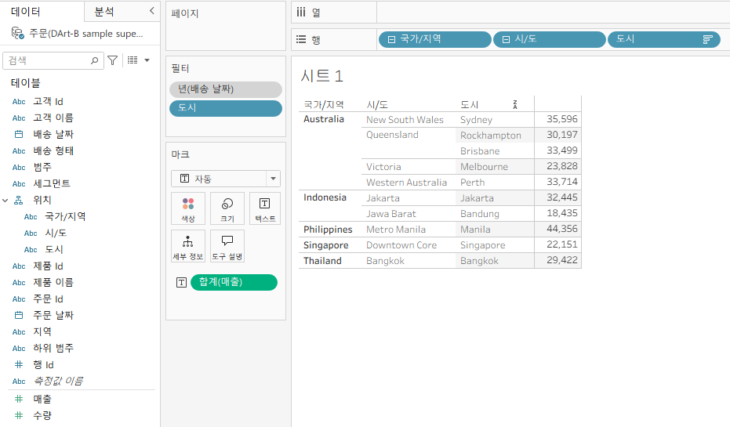
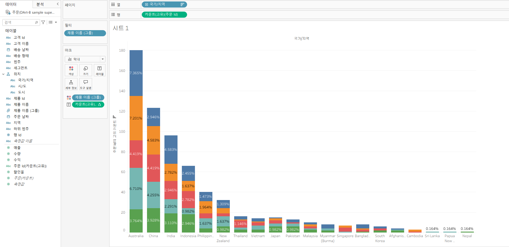

# Tableau 3주차 정규과제

📌Tableau 정규과제는 매주 정해진 **유튜브 강의를 통해 태블로 이론 및 기능을 학습한 후, 실습 문제를 풀어보며 이해도를 높이는 학습 방식**입니다. 

이번주는 아래의 **Tableau_3rd_TIL**에 명시된 유튜브 강의를 먼저 수강해주세요. 학습 중에는 주요 개념을 스스로 정리하고, 이해가 어려운 부분은 강의 자료나 추가 자료를 참고해 보완하세요. 과제 작성이 끝난 이후에는 **Github에 TIL과 실습 인증 결과를 업로드 후, 과제 시트에 제출해주세요.**


**(수행 인증샷은 필수입니다.)** 

> 태블로를 활용하는 과제인 경우, 따로 캡쳐도구를 사용하여 이미지를 첨가해주세요.


## Tableau_3rd_TIL

### 20. 파이와 도넛차트

### 21. 워드와 버블차트

### 22. 이중축과 결합축

### 23. 분산형 차트

### 24. 히스토그램

### 25. 박스 플롯

### 26. 영역차트

### 27. 간트차트

### 28. 필터

### 29. 그룹


<br>

## 주차별 학습 (Study Schedule)

| 주차  | 공부 범위          | 완료 여부 |
| ----- | ------------------ | --------- |
| 1주차 | **강의 1 ~ 9강**   | ✅         |
| 2주차 | **강의 10 ~ 19강** | ✅         |
| 3주차 | **강의 20 ~ 29강** | ✅         |
| 4주차 | **강의 30 ~ 39강** | 🍽️         |
| 5주차 | **강의 40 ~ 49강** | 🍽️         |
| 6주차 | **강의 50 ~ 59강** | 🍽️         |
| 7주차 | **강의 60 ~ 69강** | 🍽️         |

<!-- 여기까진 그대로 둬 주세요-->


---

# 학습 내용 정리

## 20강: 파이와 도넛차트
- 파이: 전체 대비 항목 비율을 직관적으로 비교(항목 수가 3~5개일 때 권장)
- 도넛: 파이 중앙을 비워 가독성↑, 중앙에 핵심 지표(총합/비율) 배치 용이
  - ⚠️주의: 항목이 많거나 값 차이가 미미하면 막대형/누적막대로 대체

> **🧞‍♀️ 도넛차트를 생성하는 법을 기록해주세요.**
1) 파이 차트 만들기: 마크에 `파이` 선택 → `차원`을 색상, `측정값`을 각도/레이블에 배치  
2) 원 크기 키우기: 마크 → 크기 조절  
3) 중앙 비우기(권장 2가지)
   - **이중축 방식**: 같은 측정값을 `행`(또는 `열`)에 2번 배치 → 두 마크 모두 파이 → 두 번째 파이의 크기를 더 작게 → 색상 ‘흰색’ 설정 → 이중축 → 축 동기화 → 헤더 숨김  
   - **원형 마스크 이미지 사용**: 배경 이미지/모양으로 흰 원을 겹치기(프로젝트 규정 시 사용)  
4) 중앙 텍스트: 마크 → 레이블에 `TOTAL` 또는 핵심 KPI 배치


## 21강: 워드와 버블차트
- 워드(Word Cloud): 빈도/중요도에 따라 글자 크기·색상으로 표현(범주 수가 많을 때 탐색용)
- 버블(Bubble): 점(원) 크기로 값 크기 비교, 색상/라벨로 추가 정보 제공

```
💡 크기 인코딩은 면적 지각 왜곡 주의 → 비교 대상 수가 많으면 막대형 고려
```


## 22강: 이중축과 결합축
- 이중축(Dual Axis): 서로 다른 **척도**의 두 측정값을 같은 뷰에 겹쳐 비교(예: 매출 막대 + 이익율 라인)
- 결합축(Combined Axis): 같은 **척도**의 여러 측정값을 하나의 축에 함께 표시(예: 카테고리별 매출·수량)

```
💡 이중축 사용 시 축 동기화/색상 대비/마크 유형 구분으로 과적합 시각화 방지
```


## 23강: 분산형 차트

- 두 연속형 변수의 상관/패턴/클러스터 탐색
- 마크: **원**, 세부정보에 식별자 추가
- 추세선/클러스터 기능으로 패턴 보조 분석

```js
강의 영상과 달리, 우리 파일에는 '제조 업체' 필드가 없습니다. 필요한 경우, 계산된 필드를 이용해 'SPLIT([제품 이름], ' ', 1)'를 '제조 업체'로 정의하시고 세부 정보에 놓아주세요.
```


## 24강: 히스토그램
- 단일 연속형 변수의 분포(빈도) 파악에 사용
- `분석` → `히스토그램` 또는 빈 크기(빈 너비) 수동 설정으로 해상도 조절
- 꼬리/왜도/이상치 확인, 로그 스케일·이상치 필터로 왜도 완화


## 25강: 박스플롯
- 중앙값·사분위·이상치 시각화(그룹 간 분포 비교에 적합)
- 행/열에 범주, 측정값을 축에 배치 → 마크 ‘상자 수염’
- 점(원)을 함께 표시하면 분포 밀도 이해에 도움


## 26강: 영역차트
- 시간에 따른 누적량·추세를 면적으로 표현
- 단일 영역: 추세 강조 / 누적 영역: 구성비 변화 확인
- 항목이 많으면 가독성 저하 → 주요 항목만 노출 권장


## 27강: 간트차트
- 기간(시작~종료)과 진행상태 표현(프로젝트 일정/리드타임)
- 행: 항목, 열: `시작일` → 마크 ‘간트 바’, 크기: `기간(종료-시작)`
- 현재일 참조선·상태 색상으로 진행 상황 가독성↑


## 28강: 필터
- 데이터 하위집합 선택(차원/측정값/대시보드 상호작용)
- 컨텍스트 필터로 선행 필터 지정(성능·논리 우선순위 관리)
- 상대 날짜/상위 N 필터로 동적 분석 지원


## 29강: 그룹
- 여러 범주를 사용자 지정 묶음으로 통합(라벨 정리/소분류 합치기)
- 마크 다중 선택 → ‘그룹 만들기’ 또는 데이터 패널에서 그룹 생성
- 그룹(재분류) vs 계층(드릴다운 경로) 혼동 주의


# 확인문제

## 문제 1.

```js
푸앙이는 superstore 데이터셋에서 '주문' 테이블을 보고 있습니다.
1) 국가/지역 - 시/도- 도시 의 계층을 생성했습니다. 계층 이름은 '위치'로 설정하겠습니다.
2) 날짜의 데이터 타입을 '날짜'로 바꾸었습니다.

코로나 시기의 도시별 매출 top10을 확인하고자
1) 배송 날짜가 코로나시기인 2021년, 2022년에 해당하는 데이터를 필터링했고
2) 위치 계층을 행으로 설정해 펼쳐두었습니다.
이때, 매출의 합계가 TOP 10인 도시들만을 보았습니다.
```


```
겉보기에는 전체 10개로, 잘 나온 결과처럼 보입니다. 그러나 푸앙이는 치명적인 실수를 저질렀습니다.
오늘 배운 '컨텍스트 필터'의 내용을 고려하여 올바른 풀이 및 결과를 구해주세요.
```


<!-- DArt-B superstore가 아닌 개인 superstore 파일을 사용했다면 값이 다르게 표시될 수 있습니다.-->


## 문제 2.

```js
미정이는 관심이 있는 제품사들이 있습니다. '제품 이름' 필드에서 '삼성'으로 시작하는 제품들을 'Samsung group'으로, 'Apple'으로 시작하는 제품들을 'Apple group'으로, 'Canon'으로 시작하는 제품들을 'Canon group'으로, 'HP'로 시작하는 제품들을 'HP group', 'Logitech'으로 시작하는 제품들을 'Logitech group'으로 그룹화해서 보려고 합니다. 나머지는 기타로 설정해주세요. 이 그룹화를 명명하는 필드는 'Product Name Group'으로 설정해주세요.

(이때, 드래그보다는 멤버 찾기 > 시작 문자 설정하여 모두 찾아 한번에 그룹화해 확인해보세요.)
```


```js
해당 그룹별로 어떤 국가/지역이 주문을 많이 차지하는지를 보고자 합니다. 매출액보다는 주문량을 보고 싶으므로, 주문Id의 카운트로 계산하겠습니다.

기타를 제외하고 지정한 5개의 그룹 하위 목들만을 이용해 아래와 같이 지역별 누적 막대그래프를 그려봐주세요.
```





<br>

<br>

### 🎉 수고하셨습니다.