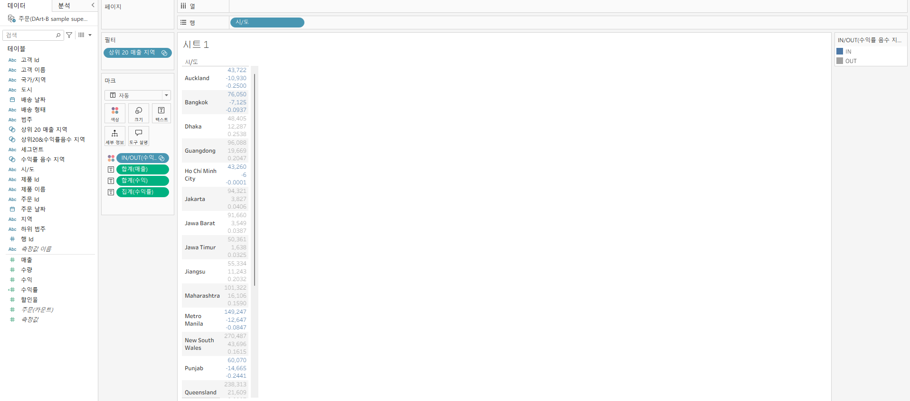

# Tableau 4주차 정규과제

📌Tableau 정규과제는 매주 정해진 **유튜브 강의를 통해 태블로 이론 및 기능을 학습한 후, 실습 문제를 풀어보며 이해도를 높이는 학습 방식**입니다. 

이번주는 아래의 **Tableau_4th_TIL**에 명시된 유튜브 강의를 먼저 수강해주세요. 학습 중에는 주요 개념을 스스로 정리하고, 이해가 어려운 부분은 강의 자료나 추가 자료를 참고해 보완하세요. 과제 작성이 끝난 이후에는 **Github에 TIL과 실습 인증 결과를 업로드 후, 과제 시트에 제출해주세요.**

**(수행 인증샷은 필수입니다.)** 

> 태블로를 활용하는 과제인 경우, 따로 캡쳐도구를 사용하여 이미지를 첨가해주세요.

## Tableau_4th_TIL

### 30. 계층

### 31. 집합

### 32. 결합집합

### 33. 계산된 필드

### 34. 행수준계산

### 35. 집계계산

### 36. 테이블 계산

### 37. 퀵테이블 계산(1)

### 38. 퀵테이블 계산(2)

 

## 주차별 학습 (Study Schedule)

| 주차  | 공부 범위          | 완료 여부 |
| ----- | ------------------ | --------- |
| 1주차 | **강의 1 ~ 9강**   | ✅         |
| 2주차 | **강의 10 ~ 19강** | ✅         |
| 3주차 | **강의 20 ~ 29강** | ✅         |
| 4주차 | **강의 30 ~ 38강** | ✅         |
| 5주차 | **강의 39 ~ 49강** | 🍽️         |
| 6주차 | **강의 50 ~ 59강** | 🍽️         |
| 7주차 | **강의 60 ~ 69강** | 🍽️         |

> **🧞‍♀️ 오늘의 스터디는 지니와 함께합니다.**

<!-- 여기까진 그대로 둬 주세요-->

---

# 학습 내용 정리

## 30. 계층
- 계층 : 데이터의 상위-하위 관계(드릴다운 구조)를 표현할 수 있음
- ex. 지역 → 시/도 → 시/군/구 순서로 계층 설정, 시각화에서 클릭하여 세부 데이터 탐색
- 계층 생성 : 데이터 패널에서 필드를 드래그해 계층으로 묶어서 사용

## 31. 집합

- 집합 : 조건을 만족하는 데이터의 부분집합
- ex. 매출 상위 20개 도시, 특정 카테고리만 모아서 분석할 때 사용
- 동적 집합과 정적집합으로 구분
  - 동적 집합 : 조건에 따라 자동으로 업데이트
  - 정적 집합 : 사용자가 직접 지정

## 32. 결합집합
- 두 집합을 교집합, 합집합, 차집합 방식으로 결합하여 새로운 데이터 그룹 생성
- ex. 매출 상위 20개 집합과 수익률 음수 집합을 결합하여 교집합을 추출하면 매출 상위이면서 수익률 낮은 지역 확인 가능

## 33. 계산된 필드
- 기존 데이터에서 새로운 변수를 만드는 기능
- ex. 수익률 = 수익 / 매출 과 같이 사용자 정의 지표 추가 
- 조건문, 수학적 연산, 문자열 처리 등 자유롭게 정의할 수 있음

## 34. 행수준계산
- 데이터 원본의 각 행에 대해 계산
- ex. IF 매출 > 10000 TEHN "High" ELSE "Low" END → 각 주문 행마다 High/Low 분류

## 35. 집계계산
- 여러 행을 집계하여 하나의 값으로 요약
- ex. AVG([매출]), SUM([수익])
- 뷰의 차원에 따라 계산 결과가 달라지므로, 집계 수준을 고려해야함

## 36. 테이블계산
- 시각화된 결과(집계된 값)에 대해 추가 계산을 수행
- ex. 순위(RANK), 누계(RUNNING_SUM), 전월 대비 차이 등
- 뷰에서 표현된 데이터의 레이아웃과 방향(행/열 테이블) 설정이 중요

## 37. 퀵테이블계산(1)
- 테이블 계산을 메뉴에서 바로 적용 가능
- ex. 누계, 차이, 비율 차이, 구성 비율 등을 자동 적용
- 직접 수식을 작성하지 않고도 클릭 몇 번으로 계산 가능

## 38. 퀵테이블계산(2)
- 이동 평균, YTD 총계, 전년 대비 성장률, YTD 성장률 등 고급 퀵테이블 계산 제공
- ex. 이동평균(4개월) → 월별 매출의 트렌드 파악, 전년 대비 성장률 → 시즌별 성과 비교

# 확인문제

## 문제 1.

푸앙이는 이제껏 매출을 올리는 데에 힘썼었지만, 왠지 모르게 주머니에 들어오는 돈이 없어 속상합니다. 

그래서 매출이 상위 20곳에 속하지만, 수익률(%)이 마이너스인 시/도를 확인하려고 합니다.

> **수익률은 SUM([수익]) / SUM([매출])로 정의합니다.**

어떤 집합을 만들었고, 어떤 결합을 하였는지를 중심으로 기술하고, 결과 자료를 첨부해주세요. (텍스트 표 형태이며, 색상으로 위 집합을 구분할 수 있게 만들어주세요.)

<!-- 아래 예시 이미지를 삭제하고, 직접 만든 시트 사진을 올려주세요. 시트의 이름은 본인 이름으로 기입해주세요-->

## 문제 2.

> **푸앙이는 주문 Id별로 주문에서 배송까지에 걸리는 날짜 일수가 궁금했습니다. 
> 그래서 주문 ID별로 주문에서 배송까지 걸리는 일자를 '배송까지 걸린 일수'라는 계산된 필드로 만들고, 이를 마크에 올린 후 확인해보았습니다.  이때, 계산된 필드의 식은 'DATEDIFF' 함수를 이용하였습니다.**

**배송까지 걸린 일수 계산을 위한 DATEDIFF 함수 수식을 적어주세요.**

~~~
DATEDIFF('day', [주문 날짜], [배송 날짜])
~~~

>  **그런데 위 그림처럼 '주문 날짜'와 '배송 날짜'를 함께 행에 올려 확인해보니, 주문날짜와 배송날짜의 차이가 '배송까지 걸린 일수'와 다릅니다. ID-2021-11126을 보니, 11월 26일 배송에 11월 30일 배송이면 4일 차이인데, 12일이 걸렸다고 하네요. 왜 이런 문제가 생긴걸까요?**

~~~
주문 ID 별로 여러 개 주문되면 세부 레코드 단위로 주문일고 배송일이 반복됨. 
DATEDIFF 가 레코드 단위에서 계산되면서 실제보다 큰 값으로 나옴
주문 ID 별 최소 주문일과 최대 배송일 기준으로 해야함
~~~

> **그리고 이를 해결하기 위해서는 어떻게 해야할까요?**

~~~
주문 ID 단위로 최소 주문일, 최대 배송일 묶어서 계산
{ FIXED [주문 ID] : DATEDIFF('day', MIN([주문 날짜]), MAX([배송날짜])) }
~~~

## 문제 3.

다음은 Tableau의 다양한 계산을 사용할 수 있는 경우를 빈칸으로 두고 문제를 작성한 것입니다. 각 빈칸에 적합한 계산 유형을 채워보세요.

> 보기 
>
> **누계, 차이, 비율 차이, 구성 비율, 순위, 백분위수, 이동 평균, YTD 총계, 통합 성장률, 전년 대비 성장률, YTD 성장률**

| 계산 유형       | 설명                                     | 사용 예시                                                    |
| --------------- | ---------------------------------------- | ------------------------------------------------------------ |
| 누계 | 데이터의 누적 합계를 계산                | 한 기업이 월별 매출 데이터를 누적하여 연간 매출 추이를 보고 싶을 때 사용 |
| 차이    | 연속 데이터 포인트 간의 차이를 계산      | 한 기업이 월별 매출 데이터에서 전월 대비 매출 증감량을 분석하고 싶은 경우 |
| 비율 차이 | 연속 데이터 포인트 간의 비율 변화를 계산 | 한 기업이 월별 매출 데이터에서 전월 대비 매출 증감률(%)을 분석하고 싶은 경우 |
| 구성 비율   | 전체에서 각 데이터 포인트의 비율을 계산  | 한 기업이 전체 매출에서 각 제품군이 차지하는 비율을 보고 싶을 때 사용 |
| 순위  | 데이터의 순위를 매깁니다                 | 한 기업이 제품별 매출 데이터를 순위별로 정렬하여 상위 10개 제품을 분석하고 싶은 경우 |
| 백분위수 | 데이터의 백분위를 계산                   | 한 기업이 고객별 구매 금액 데이터를 백분위수로 나누어 상위 25% 고객을 분석하고 싶은 경우 |
| 이동 평균  | 일정 기간의 평균을 계산                  | 한 기업이 주간 매출 데이터에서 4주 이동 평균을 계산하여 트렌드를 분석하고 싶은 경우 |
| YTD 총계  | 연초부터 현재까지의 총계를 계산          | 한 기업이 월별 매출 데이터를 연초부터 현재까지 누적하여 연간 매출 목표 달성 여부를 분석하고 싶은 경우 |
| 통합 성장률   | 일정 기간 동안의 연평균 성장률을 계산    | 한 기업이 5년 간 매출 데이터를 바탕으로 연평균 성장률(CAGR)을 계산하고 싶은 경우 |
| 전년 대비 성장률   | 전년 동기간 대비 성장률을 계산           | 한 기업이 월별 매출 데이터에서 전년 동월 대비 매출 성장률을 분석하고 싶은 경우 |
| YTD 성장률   | 연초부터 현재까지의 성장률을 계산        | 한 기업이 올해 연초부터 현재까지의 매출이 전년 동기 대비 얼마나 성장했는지 분석하고 싶은 경우 |

> 사용 예시를 참고하여 실제 경우처럼 생각하며 고민해보아요!

 

 

### 🎉 수고하셨습니다.